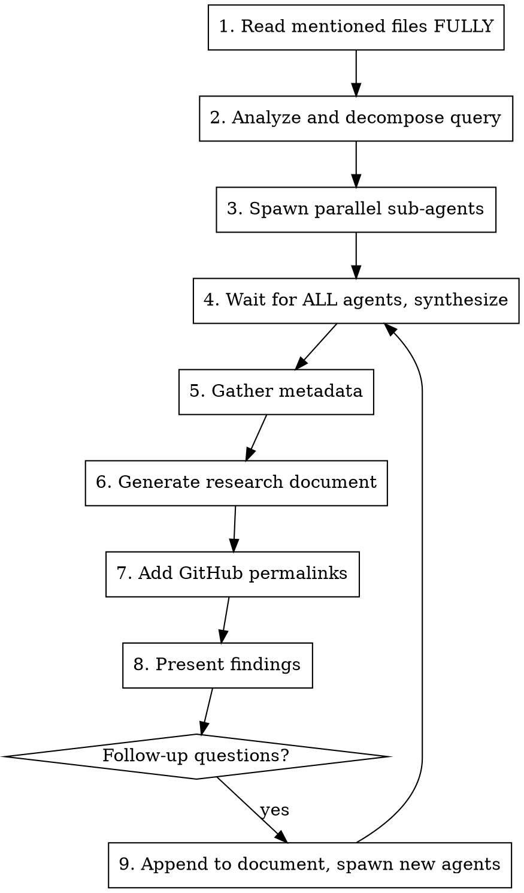

# Comprehensive Research

Conduct comprehensive research across the codebase by spawning parallel sub-agents and synthesizing their findings into a structured research document.

**Core principle:** Read mentioned files first, decompose into parallel sub-tasks, wait for ALL results, then synthesize.

## Initial Setup

When this skill is invoked, respond with:

```
I'm ready to research the codebase. Please provide your research question or area of interest, and I'll analyze it thoroughly by exploring relevant components and connections.
```

Then wait for the user's research query.

## The Process



## Step 1: Read Mentioned Files First

**CRITICAL:** If the user mentions specific files (tickets, docs, JSON), read them FULLY first.

- Use the Read tool WITHOUT limit/offset parameters to read entire files
- Read these files yourself in the main context before spawning any sub-tasks
- This ensures you have full context before decomposing the research

## Step 2: Analyze and Decompose

- Break down the user's query into composable research areas
- Take time to think deeply about underlying patterns, connections, and architectural implications
- Identify specific components, patterns, or concepts to investigate
- Create a research plan using TaskCreate to track all subtasks
- Consider which directories, files, or architectural patterns are relevant

## Step 3: Spawn Parallel Sub-Agents

Create multiple agents to research different aspects concurrently.

**Agent selection:**

| Agent Type | Use For | CLI Alternative |
|------------|---------|-----------------|
| Explore (Claude) | Code exploration, finding files | - |
| general-purpose (Claude) | Deep analysis, cross-service questions | - |
| Gemini CLI | Documentation synthesis, long context | `gemini` |
| Codex CLI | Code-focused search and analysis | `codex` |

**Agent prompt guidance:**
- Start with locator agents to find what exists
- Then use analyzer agents on the most promising findings
- Run multiple agents in parallel when searching for different things
- Each agent knows its job - just tell it what you're looking for
- Don't write detailed prompts about HOW to search - agents already know

### Locator vs Analyzer Patterns

See `./agents/` for full system prompts and examples:
- **`./agents/locator.md`** - Find where things are (paths, entry points)
- **`./agents/analyzer.md`** - Deep understanding of specific code

| Pattern | Goal | Output | Agent Type |
|---------|------|--------|------------|
| Locator | Discover locations | Paths grouped by purpose | Explore + Opus |
| Analyzer | Deep understanding | Detailed analysis, connections | general-purpose, Codex, Gemini |

**Two-phase pattern:**
```
Phase 1 (parallel locators):
  Locator A → "Find all error handling in service X"
  Locator B → "Find all error handling in service Y"
  Locator C → "Find error-related documentation"

Phase 2 (targeted analyzers, after locators return):
  Analyzer → "Analyze these specific files: [paths from locators]"
```

**Model selection by task:**
| Task | Model | Why |
|------|-------|-----|
| Locator (find files) | Explore + Opus | Better codebase understanding |
| Code-focused analysis | Codex CLI | Code-optimized |
| Single file analysis | Sonnet | Balanced |
| Complex architecture | Opus | Deep reasoning |
| Doc + code synthesis | Gemini CLI | Long context |

**For non-Claude agents, use CLI:**
```bash
# Gemini CLI
gemini "Research question about documentation..."

# Codex CLI
codex "Find all usages of X pattern in the codebase..."
```

## Step 4: Wait and Synthesize

**IMPORTANT:** Wait for ALL sub-agent tasks to complete before proceeding.

Synthesis checklist:
- [ ] Compile all sub-agent results (both live codebase and existing research/ docs)
- [ ] Prioritize live codebase findings as primary source of truth
- [ ] Use existing research/ documents as supplementary historical context
- [ ] Connect findings across different components
- [ ] Include specific file paths and line numbers for reference
- [ ] Verify all file paths are correct and exist
- [ ] Highlight patterns, connections, and architectural decisions
- [ ] Answer the user's specific questions with concrete evidence

## Step 5: Gather Metadata

Generate all relevant metadata before writing the document:

```bash
# Get current date
date +%Y-%m-%d

# Get git info
git rev-parse HEAD
git branch --show-current
basename $(git rev-parse --show-toplevel)
```

**Filename format:** `research/YYYY-MM-DD-description.md`
- YYYY-MM-DD is today's date
- description is a brief kebab-case description of the research topic
- Examples: `research/2025-01-08-authentication-flow.md`

## Step 6: Generate Research Document

**NEVER write the document with placeholder values.** Use metadata from step 5.

```markdown
---
date: [Current date and time with timezone in ISO format]
researcher: [Researcher name]
git_commit: [Current commit hash]
branch: [Current branch name]
repository: [Repository name]
topic: "[User's Question/Topic]"
last_updated: [Current date in YYYY-MM-DD format]
last_updated_by: [Researcher name]
---

# Research: [User's Question/Topic]

**Date**: [Current date and time with timezone]
**Researcher**: [Researcher name]
**Git Commit**: [Current commit hash]
**Branch**: [Current branch name]
**Repository**: [Repository name]

## Research Question

[Original user query]

## Summary

[High-level findings answering the user's question]

## Detailed Findings

### [Component/Area 1]

- Finding with reference ([file.ext:line](link))
- Connection to other components
- Implementation details

### [Component/Area 2]

...

## Code References

- `path/to/file.py:123` - Description of what's there
- `another/file.ts:45-67` - Description of the code block

## Architecture Insights

[Patterns, conventions, and design decisions discovered]

## Historical Context (from research/)

[Relevant insights from research/ directory with references]

## Related Research

[Links to other research documents in research/]

## Open Questions

[Any areas that need further investigation]
```

## Step 7: Add GitHub Permalinks

If on main branch or commit is pushed, generate GitHub permalinks:

```bash
# Check branch and status
git branch --show-current
git status

# Get repo info
gh repo view --json owner,name

# Permalink format
https://github.com/{owner}/{repo}/blob/{commit}/{file}#L{line}
```

Replace local file references with permalinks in the document.

## Step 8: Present Findings

- Present a concise summary of findings to the user
- Include key file references for easy navigation
- Ask if they have follow-up questions or need clarification

## Step 9: Handle Follow-ups

If the user has follow-up questions:

1. **Append to the same research document** (don't create new file)
2. **Update frontmatter:**
   - Update `last_updated` and `last_updated_by`
   - Add `last_updated_note: "Added follow-up research for [brief description]"`
3. **Add new section:** `## Follow-up Research [timestamp]`
4. **Spawn new sub-agents** as needed for additional investigation
5. **Continue updating** the document and syncing

## Critical Ordering Rules

**ALWAYS follow the numbered steps exactly:**

| Rule | Consequence of Violation |
|------|--------------------------|
| Read mentioned files FIRST (step 1) | Missing context, wrong decomposition |
| Wait for ALL agents (step 4) | Incomplete synthesis |
| Gather metadata BEFORE writing (step 5→6) | Placeholder values in document |
| NEVER write with placeholders | Broken references, unusable document |

## Red Flags

| Thought | Reality |
|---------|---------|
| "I'll spawn agents before reading the files" | NO. Read files first for context. |
| "I'll synthesize as agents return" | NO. Wait for ALL agents. |
| "I'll fill in metadata later" | NO. Gather metadata first. |
| "I'll create a new doc for follow-ups" | NO. Append to existing document. |
| "I don't need GitHub permalinks" | YES you do. They're permanent references. |

## Directory Structure

```
research/                    # Research documents directory
  YYYY-MM-DD-topic.md       # Research documents with date prefix
  past/                     # Historical research for context
  ...
```

## Frontmatter Consistency

- Always include frontmatter at the beginning of research documents
- Keep frontmatter fields consistent across all research documents
- Update frontmatter when adding follow-up research
- Use snake_case for multi-word field names (e.g., `last_updated`, `git_commit`)
- Tags should be relevant to the research topic and components studied

## Integration Notes

- **Always use parallel Task agents** to maximize efficiency and minimize context usage
- **Always run fresh codebase research** - never rely solely on existing research documents
- **Check existing research/ documents** for historical context to supplement live findings
- **Focus on concrete file paths and line numbers** for developer reference
- **Research documents should be self-contained** with all necessary context
- **Each sub-agent prompt should be specific** and focused on read-only operations
- **Consider cross-component connections** and architectural patterns
- **Include temporal context** (when the research was conducted)
- **Link to GitHub when possible** for permanent references
- **Keep main agent focused on synthesis**, not deep file reading
- **Encourage sub-agents to find examples and usage patterns**, not just definitions
- **Explore all of research/ directory** for historical context and related research
