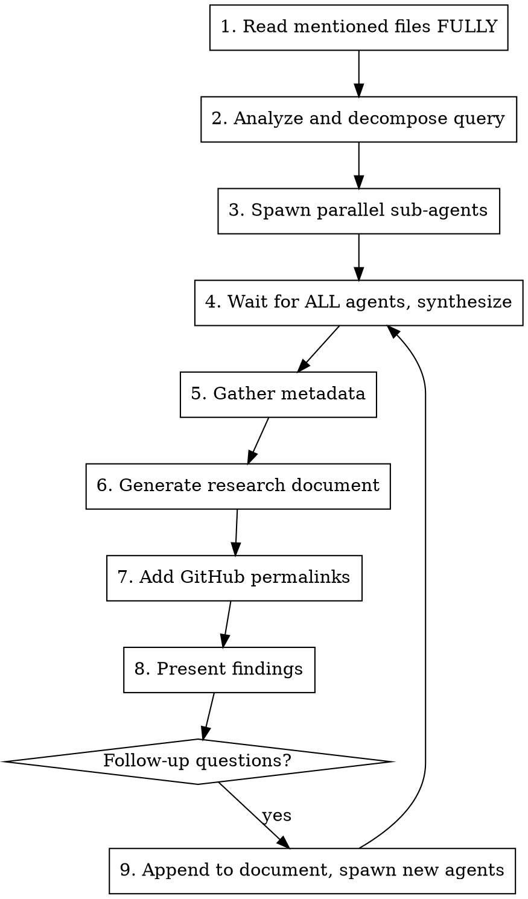

# Comprehensive Research

Conduct comprehensive research across the codebase by spawning parallel sub-agents and synthesizing their findings into a structured research document.

**Core principle:** Read mentioned files first, decompose into parallel sub-tasks, wait for ALL results, then synthesize.

## Initial Setup

When this skill is invoked, respond with:

```
I'm ready to research the codebase. Please provide your research question or area of interest, and I'll analyze it thoroughly by exploring relevant components and connections.
```

Then wait for the user's research query.

## The Process



## Step 1: Read Mentioned Files First

**CRITICAL:** If the user mentions specific files (tickets, docs, JSON), read them FULLY first.

- Use the Read tool WITHOUT limit/offset parameters to read entire files
- Read these files yourself in the main context before spawning any sub-tasks
- This ensures you have full context before decomposing the research

## Step 2: Analyze and Decompose

- Break down the user's query into composable research areas
- Take time to think deeply about underlying patterns, connections, and architectural implications
- Identify specific components, patterns, or concepts to investigate
- Create a research plan using TaskCreate to track all subtasks
- Consider which directories, files, or architectural patterns are relevant

## Step 3: Spawn Parallel Sub-Agents

Create multiple agents to research different aspects concurrently using the Task tool.

**MANDATORY: Always spawn multiple agents with diverse analysis focuses.**

| Agent Type | Model | Strengths | Use For |
|------------|-------|-----------|---------|
| Explore | haiku/sonnet | Fast file discovery, pattern search | Locating relevant files |
| general-purpose | sonnet | Balanced analysis, code tracing | Implementation details, data flow |
| general-purpose | opus | Deep reasoning, architecture | Cross-service patterns, business logic |

**Why diverse perspectives are REQUIRED:**
- Different analysis focuses notice different things - you WILL miss insights with only one
- Code-focused prompts catch implementation details architecture prompts miss
- Pattern-focused prompts see connections that function-tracing prompts don't
- Consensus across agents = high confidence; disagreement = needs deeper investigation

**Agent prompt guidance:**
- Start with locator agents (Explore) to find what exists
- Then spawn multiple analyzers with DIFFERENT FOCUSES on the findings
- Give each agent the SAME file paths and research question
- Tailor the prompt focus: architecture vs code-tracing vs cross-file patterns

### Locator vs Analyzer Patterns

See `./agents/` for full system prompts and examples:
- **`./agents/locator.md`** - Find where things are (paths, entry points)
- **`./agents/analyzer.md`** - Document how code works (NO suggestions/improvements)

| Pattern | Goal | Output | Agent Type |
|---------|------|--------|------------|
| Locator | Discover locations | Paths grouped by purpose | Explore |
| Analyzer | Document implementation | Data flow, patterns, file:line refs | general-purpose |

**Analyzer critical rule:** Analyzers document WHAT EXISTS, never suggest improvements. They are technical writers, not consultants.

**Two-phase pattern:**
```
Phase 1 (parallel locators):
  Locator A → "Find all error handling in service X"
  Locator B → "Find all error handling in service Y"
  Locator C → "Find error-related documentation"

Phase 2 (targeted analyzers, after locators return):
  Analyzer → "Analyze these specific files: [paths from locators]"
```

**Model selection by task:**
| Task | Agent Type | Model | Why |
|------|------------|-------|-----|
| Locator (find files) | Explore | sonnet | Fast file discovery |
| Code-focused analysis | general-purpose | sonnet | Detailed tracing |
| Single file analysis | general-purpose | sonnet | Balanced |
| Complex architecture | general-purpose | opus | Deep reasoning |
| Cross-file synthesis | general-purpose | opus | Pattern recognition |

**Tailoring prompts by analysis focus:**

| Focus | Strengths | Tailor Prompt Toward | Prompt Style |
|-------|-----------|---------------------|--------------|
| **Code-tracing** | Execution flow, algorithm analysis, error paths | Function-by-function tracing, data structure manipulation | Precise: "Trace the exact sequence of function calls when X happens" |
| **Cross-file patterns** | Connections across files, conventions, flow | Reading multiple files together, spotting patterns | Breadth-focused: "Read all these files and identify how they connect" |
| **Architecture** | Design patterns, service boundaries, business logic | Why decisions were made, cross-service integration | Architecture-focused: "Explain how this component fits into the larger system" |

**Prompt templates by focus:**

**Code-tracing prompt template:**
```
Research question: [question]

Files to analyze (read these):
- [absolute path 1]
- [absolute path 2]

Focus on code-level analysis:
1. Trace the execution path when [specific scenario]
2. What functions are called and in what order?
3. How is data transformed at each step?
4. What error conditions are handled?

Document what exists - no suggestions or improvements.
```

**Cross-file patterns prompt template:**
```
Research question: [question]

Read ALL these files together in full:
- [absolute path 1]
- [absolute path 2]
- [absolute path 3]

Analyze:
1. What patterns appear across multiple files?
2. How do these components connect to each other?
3. What is the complete flow from start to finish?

Document what exists - no suggestions or improvements.
```

**Architecture prompt template:**
```
Research question: [question]

Files to analyze:
- [absolute path 1]
- [absolute path 2]

Focus on architecture and integration:
1. How does this fit into the larger system?
2. What design patterns are in use?
3. How does this integrate with other services?
4. What are the key architectural decisions?

Document what exists - no suggestions or improvements.
```

**Context sharing (CRITICAL):**
- ALL agents must receive the SAME core context: file paths, research question, relevant code locations
- Include full paths explicitly so agents can find files
- If locators found specific files, pass those paths to ALL analyzers

### Parallel Multi-Focus Analysis (MANDATORY)

**IRON RULE:** Every analyzer phase MUST spawn multiple agents with different focuses in ONE message.

This is not optional. This is not "when you want diverse perspectives." This is ALWAYS.

**Pattern: Single message with multiple Task calls**
```
In ONE message, call multiple agents with different focuses:
1. Task(subagent_type="general-purpose", model="opus", prompt="...architecture focus...")
2. Task(subagent_type="general-purpose", model="sonnet", prompt="...code-tracing focus...")
3. Task(subagent_type="general-purpose", model="sonnet", prompt="...cross-file patterns focus...")
```

**Red flags - you're rationalizing if you think:**
| Excuse | Reality |
|--------|---------|
| "This is too simple for multiple agents" | Simple tasks still benefit from diverse perspectives |
| "One agent is enough for this" | Comprehensive research means comprehensive perspectives |
| "I'll use multiple agents next time" | Use them NOW. Every time. |
| "Different focuses won't add value" | Different prompts catch different things |

**Example: Analyzing error handling across services**

Note how ALL agents get the SAME context (file paths, research question) but prompts are TAILORED to different analysis focuses:

```
# All in ONE message - runs in parallel:

# Architecture focus (opus for deep reasoning)
Task(subagent_type="general-purpose", model="opus", prompt="""
Research question: How does error handling work in order-changes service?

Files to analyze:
- ~/carrot/customers/commerce/order-changes/handler/rpc/.../handler.go:90-131
- ~/carrot/customers/commerce/order-changes/pkg/processor/processor.go

Focus on: How errors flow between handler and processor layers, architectural patterns, integration with other services.
Document what exists - no suggestions.
""")

# Code-tracing focus (sonnet for detailed tracing)
Task(subagent_type="general-purpose", model="sonnet", prompt="""
Research question: How does error handling work in order-changes service?

Files to analyze:
- ~/carrot/customers/commerce/order-changes/handler/rpc/.../handler.go:90-131
- ~/carrot/customers/commerce/order-changes/pkg/processor/processor.go

Focus on: Trace the exact code path when an error occurs. What functions are called? What error types exist? How are they classified?
Document what exists - no suggestions.
""")

# Cross-file patterns focus (sonnet for pattern recognition)
Task(subagent_type="general-purpose", model="sonnet", prompt="""
Research question: How does error handling work in order-changes service?

Files to analyze:
- ~/carrot/customers/commerce/order-changes/handler/rpc/.../handler.go:90-131
- ~/carrot/customers/commerce/order-changes/pkg/processor/processor.go

Read both files together. Focus on: How do error handling patterns connect across these files? What is the complete error flow from request to response?
Document what exists - no suggestions.
""")
```

**Synthesis after parallel completion:**
- Wait for ALL results (use TaskOutput for background tasks)
- Compare findings across all agents
- Note agreements (high confidence) and disagreements (needs investigation)
- Synthesize into unified analysis WITH ATTRIBUTION:

```markdown
## Synthesis

### Consensus (all agents agree)
- [Finding that all analysis perspectives identified]

### Architectural perspective
- [Unique insight about cross-service patterns]

### Code-level analysis
- [Unique insight about code logic/algorithms from tracing]

### Cross-file patterns
- [Unique insight about connections across files]

### Disagreements / Areas needing deeper investigation
- [Where agents disagreed - investigate further]
```

**Red Flags:**
| If you... | You're doing it wrong |
|-----------|----------------------|
| Call agents one-at-a-time | Use ONE message with multiple Task calls |
| Only spawn one agent | MUST spawn multiple with different focuses |
| Skip attribution in synthesis | Each perspective's contribution must be visible |
| Don't note disagreements | Disagreements reveal complexity - highlight them |

## Step 4: Wait and Synthesize

**IMPORTANT:** Wait for ALL sub-agent tasks to complete before proceeding.

Synthesis checklist:
- [ ] Compile all sub-agent results (both live codebase and existing research/ docs)
- [ ] Prioritize live codebase findings as primary source of truth
- [ ] Use existing research/ documents as supplementary historical context
- [ ] Connect findings across different components
- [ ] Include specific file paths and line numbers for reference
- [ ] Verify all file paths are correct and exist
- [ ] Highlight patterns, connections, and architectural decisions
- [ ] Answer the user's specific questions with concrete evidence

## Step 5: Gather Metadata

Generate all relevant metadata before writing the document:

```bash
# Get current date
date +%Y-%m-%d

# Get git info
git rev-parse HEAD
git branch --show-current
basename $(git rev-parse --show-toplevel)
```

**Filename format:** `research/YYYY-MM-DD-description.md`
- YYYY-MM-DD is today's date
- description is a brief kebab-case description of the research topic
- Examples: `research/2025-01-08-authentication-flow.md`

## Step 6: Generate Research Document

**NEVER write the document with placeholder values.** Use metadata from step 5.

```markdown
---
date: [Current date and time with timezone in ISO format]
researcher: [Researcher name]
git_commit: [Current commit hash]
branch: [Current branch name]
repository: [Repository name]
topic: "[User's Question/Topic]"
last_updated: [Current date in YYYY-MM-DD format]
last_updated_by: [Researcher name]
---

# Research: [User's Question/Topic]

**Date**: [Current date and time with timezone]
**Researcher**: [Researcher name]
**Git Commit**: [Current commit hash]
**Branch**: [Current branch name]
**Repository**: [Repository name]

## Research Question

[Original user query]

## Summary

[High-level findings answering the user's question]

## Detailed Findings

### [Component/Area 1]

- Finding with reference ([file.ext:line](link))
- Connection to other components
- Implementation details

### [Component/Area 2]

...

## Code References

- `path/to/file.py:123` - Description of what's there
- `another/file.ts:45-67` - Description of the code block

## Architecture Insights

[Patterns, conventions, and design decisions discovered]

## Historical Context (from research/)

[Relevant insights from research/ directory with references]

## Related Research

[Links to other research documents in research/]

## Open Questions

[Any areas that need further investigation]
```

## Step 7: Add GitHub Permalinks

If on main branch or commit is pushed, generate GitHub permalinks:

```bash
# Check branch and status
git branch --show-current
git status

# Get repo info
gh repo view --json owner,name

# Permalink format
https://github.com/{owner}/{repo}/blob/{commit}/{file}#L{line}
```

Replace local file references with permalinks in the document.

## Step 8: Present Findings

- Present a concise summary of findings to the user
- Include key file references for easy navigation
- Ask if they have follow-up questions or need clarification

## Step 9: Handle Follow-ups

If the user has follow-up questions:

1. **Append to the same research document** (don't create new file)
2. **Update frontmatter:**
   - Update `last_updated` and `last_updated_by`
   - Add `last_updated_note: "Added follow-up research for [brief description]"`
3. **Add new section:** `## Follow-up Research [timestamp]`
4. **Spawn new sub-agents** as needed for additional investigation
5. **Continue updating** the document and syncing

## Critical Ordering Rules

**ALWAYS follow the numbered steps exactly:**

| Rule | Consequence of Violation |
|------|--------------------------|
| Read mentioned files FIRST (step 1) | Missing context, wrong decomposition |
| Wait for ALL agents (step 4) | Incomplete synthesis |
| Gather metadata BEFORE writing (step 5→6) | Placeholder values in document |
| NEVER write with placeholders | Broken references, unusable document |

## Red Flags

| Thought | Reality |
|---------|---------|
| "I'll spawn agents before reading the files" | NO. Read files first for context. |
| "I'll synthesize as agents return" | NO. Wait for ALL agents. |
| "I'll fill in metadata later" | NO. Gather metadata first. |
| "I'll create a new doc for follow-ups" | NO. Append to existing document. |
| "I don't need GitHub permalinks" | YES you do. They're permanent references. |

## Directory Structure

```
research/                    # Research documents directory
  YYYY-MM-DD-topic.md       # Research documents with date prefix
  past/                     # Historical research for context
  ...
```

## Frontmatter Consistency

- Always include frontmatter at the beginning of research documents
- Keep frontmatter fields consistent across all research documents
- Update frontmatter when adding follow-up research
- Use snake_case for multi-word field names (e.g., `last_updated`, `git_commit`)
- Tags should be relevant to the research topic and components studied

## Integration Notes

- **Always use parallel Task agents** to maximize efficiency and minimize context usage
- **Always run fresh codebase research** - never rely solely on existing research documents
- **Check existing research/ documents** for historical context to supplement live findings
- **Focus on concrete file paths and line numbers** for developer reference
- **Research documents should be self-contained** with all necessary context
- **Each sub-agent prompt should be specific** and focused on read-only operations
- **Consider cross-component connections** and architectural patterns
- **Include temporal context** (when the research was conducted)
- **Link to GitHub when possible** for permanent references
- **Keep main agent focused on synthesis**, not deep file reading
- **Encourage sub-agents to find examples and usage patterns**, not just definitions
- **Explore all of research/ directory** for historical context and related research
