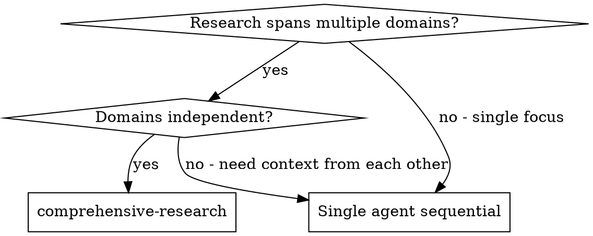
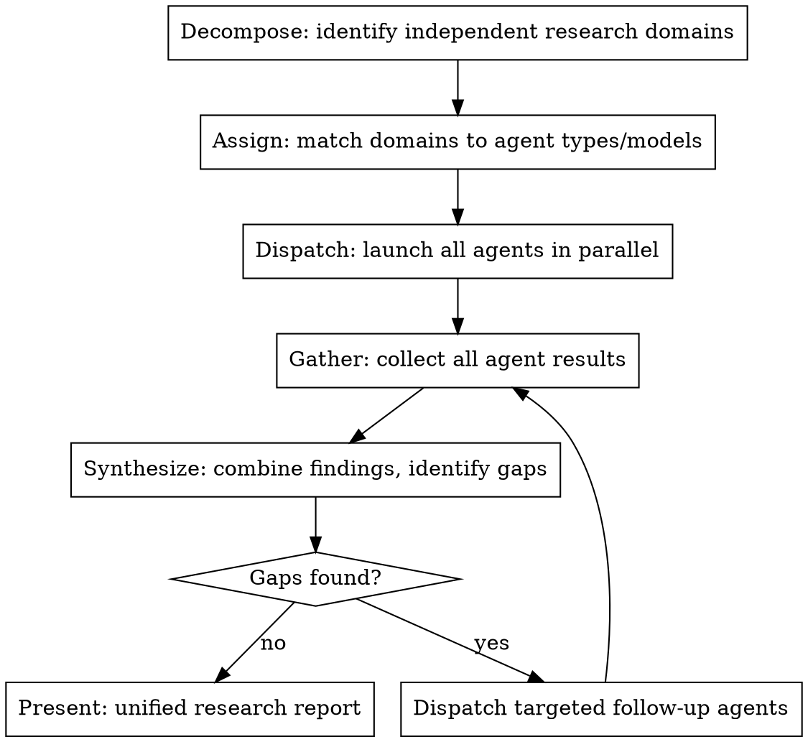

# Comprehensive Research

Research complex topics using parallel subagents, each specialized for a domain or model capability.

**Core principle:** Dispatch one agent per independent research domain. Synthesize after all return.

## When to Use



**Use when:**
- Research spans 2+ codebases or services
- Multiple aspects can be investigated independently
- Different model strengths could be leveraged
- Need comprehensive coverage, not just first answer

**Don't use when:**
- Single focused question with clear location
- Domains are tightly coupled (need findings from A to research B)
- Quick lookup, not deep research

## The Process



## Domain Decomposition

Group research by what can be investigated independently:

| Domain Type | Example | Why Independent |
|-------------|---------|-----------------|
| Codebase | order-changes (Go) vs customers-backend (Ruby) | Different repos, languages, patterns |
| Aspect | Error handling vs Caching vs API contracts | Different concerns, different files |
| Layer | Frontend vs Backend vs Infrastructure | Different expertise needed |
| Source | Code vs Documentation vs Tribal knowledge | Different search strategies |

**Decomposition checklist:**
- [ ] Can agent A complete without agent B's findings?
- [ ] Do domains overlap in files they'd search?
- [ ] Would one agent's changes affect another's investigation?

If any answer is "no", those domains should be combined or sequenced.

## Agent/Model Selection

Match domains to the right agent type or model:

| Research Need | Agent Type | Model Suggestion | Why |
|--------------|-----------|------------------|-----|
| Code exploration | Explore | Claude (any) | Built-in codebase tools |
| Deep code analysis | general-purpose | Claude Sonnet/Opus | Reasoning over complex code |
| Documentation synthesis | general-purpose | Gemini | Strong at summarization |
| Rapid code search | Explore | Claude Haiku | Fast, cheap, focused |
| External API research | general-purpose | Any with WebFetch | Needs web access |
| Internal knowledge | general-purpose | Claude + Glean | Company knowledge tools |

**When to use Glean vs code search:**
- **Glean**: Tribal knowledge, Slack discussions, Confluence docs, incidents, design decisions
- **Code search**: Implementation details, file locations, specific patterns
- **Both**: Cross-service questions (code for "how", Glean for "why" and incidents)

**Model tradeoffs:**
- **Haiku**: Fast, cheap, good for focused searches. Use for: "find all files matching X"
- **Sonnet**: Balanced. Use for: "understand how X works"
- **Opus**: Deep reasoning. Use for: "analyze architecture of X and identify issues"
- **Codex**: Code-focused (if available). Use for: code generation, refactoring
- **Gemini**: Documentation (if available). Use for: summarization, knowledge synthesis

## Parallel Dispatch Pattern

**CRITICAL:** Dispatch ALL independent agents in a SINGLE message with multiple Task tool calls.

```markdown
[Dispatch all in ONE message - agents run concurrently]

Task(subagent_type="Explore", model="haiku", prompt="Research domain A...")
Task(subagent_type="Explore", model="haiku", prompt="Research domain B...")
Task(subagent_type="general-purpose", model="sonnet", prompt="Research domain C...")
```

**NOT:**
```markdown
[BAD - Sequential dispatch wastes time]

Task(prompt="Research domain A...")
[wait for result]
Task(prompt="Research domain B...")
[wait for result]
```

## Agent Prompt Structure

Each agent needs:

1. **Scope**: What domain/aspect to investigate
2. **Questions**: Specific things to find out
3. **Output format**: What to return
4. **Boundaries**: What NOT to investigate (prevent overlap)

```markdown
Research [DOMAIN NAME] in [CODEBASE/LOCATION]:

Investigate:
1. [Specific question 1]
2. [Specific question 2]
3. [Specific question 3]

Return:
- Key findings (bullet points)
- File locations for important code
- Gaps or unknowns you encountered
- Connections to other domains (if any)

Do NOT investigate: [other domains being handled by parallel agents]
```

## Synthesis Phase

After all agents return:

1. **Combine findings**: Merge into unified view
2. **Identify conflicts**: Do agents disagree on facts?
3. **Find gaps**: What questions remain unanswered?
4. **Map connections**: How do domains interact?
5. **Dispatch follow-ups**: If gaps exist, send targeted agents

**Gap detection questions:**
- Did any agent say "I couldn't find X"?
- Are there domains we forgot to assign?
- Do agent findings contradict each other?
- Does the combined picture make sense?

## Common Mistakes

| Mistake | Why Bad | Fix |
|---------|---------|-----|
| Sequential dispatch | Wastes time, defeats purpose | Single message, multiple Tasks |
| Overlapping domains | Agents do redundant work | Clear boundaries in prompts |
| No synthesis step | Raw findings, no insight | Always synthesize after gather |
| Skipping model selection | One-size-fits-all inefficient | Match model to task needs |
| Forgetting gap check | Miss important aspects | Explicit gap detection step |

## Handling Agent Failures

If an agent fails or returns incomplete results:

1. **Don't block on failure** - Continue synthesizing from successful agents
2. **Note the gap** - Failed domain becomes explicit gap in synthesis
3. **Retry with refinement** - Dispatch new agent with narrower scope or different approach
4. **Don't retry infinitely** - 2 failures on same domain = document as unknown

## Practical Limits

**Domain count:** 3-5 domains is ideal. More than 6 creates coordination overhead.

**When to combine domains:**
- Two domains would search the same files
- One domain is a subset of another
- Total domain count exceeds 6

**When to split domains:**
- Agent prompt exceeds 500 words (too much scope)
- Domain covers 3+ unrelated codebases

## Red Flags

These thoughts mean STOP - you're doing it wrong:

| Thought | Reality |
|---------|---------|
| "I'll just do this sequentially, it's simpler" | Parallel is 3x+ faster. Use the pattern. |
| "One agent can handle all of this" | If domains are independent, parallelize. |
| "I'll give one agent more context instead" | Context pollution. Fresh agents per domain. |
| "I'll skip synthesis, findings speak for themselves" | Raw findings miss connections. Synthesize. |
| "I don't need to check for gaps" | You always have gaps. Check explicitly. |
| "All models are the same for this" | Model selection matters for cost/speed/quality. |
| "I'll add more domains to be thorough" | 3-5 is optimal. More creates overhead. |

## Example: Multi-Service Error Handling Research

**Research question:** "How does error handling work across our order ecosystem?"

**Decomposition:**
- Domain 1: order-changes (Go/Temporal) error patterns
- Domain 2: customers-backend (Ruby) error patterns
- Domain 3: Error surfacing to customers (UX/API)
- Domain 4: Compensation/rollback mechanisms

**Agent assignment:**
```markdown
Task(subagent_type="Explore", model="haiku",
     prompt="Research error handling in order-changes Go service...")

Task(subagent_type="Explore", model="haiku",
     prompt="Research error handling in customers-backend Ruby...")

Task(subagent_type="general-purpose", model="sonnet",
     prompt="Research how errors are surfaced to customers - API responses, UI, notifications...")

Task(subagent_type="Explore", model="haiku",
     prompt="Research compensation and rollback mechanisms - saga patterns, reversal logic...")
```

**Synthesis:**
- Combine: Go uses error classification, Ruby uses response structure
- Connection: Both feed into TypedErrorsResponse proto
- Gap: How do async errors (DLQ) get surfaced? (dispatch follow-up)
- Report: Unified view of error handling across ecosystem

## Multi-Model Research (Future)

When Codex and Gemini agents are available via MCP:

**Model selection by task:**
| Task Type | Best Model | Rationale |
|-----------|-----------|-----------|
| Code navigation/search | Codex | Optimized for code understanding |
| Documentation synthesis | Gemini | Strong summarization, long context |
| Deep reasoning | Claude Opus | Best at complex analysis |
| Fast exploration | Claude Haiku | Cost-effective for broad searches |

**Dispatch pattern with multiple models:**
```markdown
Task(model="codex", prompt="Find all usages of X pattern...")
Task(model="gemini", prompt="Synthesize documentation about Y...")
Task(model="haiku", prompt="Search for Z in codebase...")
```

Until these are available, use Claude models with appropriate agent types.

## Integration with Other Skills

**Use with:**
- **superpowers:brainstorming** - Clarify research questions before decomposing
- **superpowers:writing-plans** - For research that leads to implementation

**Subagents should use:**
- **superpowers:systematic-debugging** - If investigation uncovers bugs
